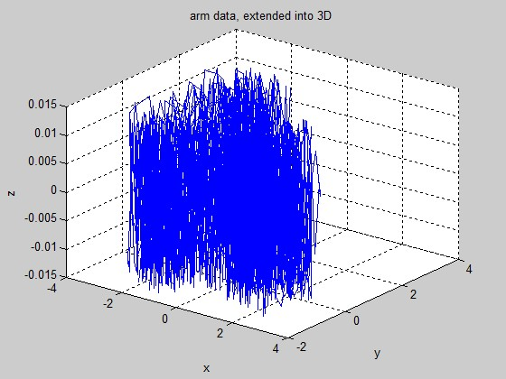

MotionSegmentation3D
====================

Matlab Code for 3D motion segmentation.

This code is extended from [Robust Motion Segmentation via Lossy Compression v 1.0](http://perception.csl.illinois.edu/coding/motion/#Software)

The code from the above link can only handle 2D motion segmentation, while in my version I extended it into 3D. For a better result, I also add a function to normalize the data before clustering.

For the basic usage, please check the [test.m](./test.m) file.

## Gallery ##

The following image shows the original arm data originally given by the above code, I let `z=sin(x)`:

The following image shows the clustered result:

